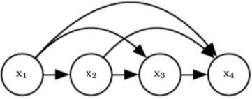

시계열 예측에서 자주 사용되는 모델

## 시계열 데이터 특성

- 시계열은 반드시 고정된 시간 구간의 관측치여야 한다
  - 시계열 구간을 작은 범위에서 큰 구간으로는 변환할 수 있지만 반대는 불가

- (목적) 미래 값을 예측

- 정상시계열(Stationary) : 평균과 표준편차가 일정하다는 조건이 선행 (ex, ARIMA)
- 비정상시계열 : 차분이나 log함수를 씌워 정상시계열로 변환 후 분석

- 시계열 정보 = 규칙적인 패턴 + 불규칙적인 패턴

  < 규칙적인 패턴 >

  - 자기 상관성 
  - 이동평균

  < 불규칙적인 패턴(White Noise) >

  - 평균이 0이며 일정한 분산을 지닌 정규분포에서 추출된 임의의 수

- 시계열 모델 사용 전 확인사항
  - 추세(Trend) : 시간이 지남에 따라 데이터에 뚜렷한 상하 추세가 있는지 확인
  - 계절(Season) : 1년안에 월, 분기로 반복되는 패턴
  - 순환(Circulation) : 경기변동이라고도 하며, 5년, 10년처럼 장기간 동안 간격을 두고 상승, 하락이 주기적으로 반복되는 패턴을 말한다. 이 때는 데이터가 크며 추세변동과 결합해 주로 분석을 진행
  - 불규칙(irregular) 변동 : 1,2,3번 변동으로는 설명할 수 없는 패턴. 모형은 두가지로 나누어진다.
    - 승법(곱셈) 모형 : 추세 * 계절 * 순환 * 불규칙 변동
    - 가법(덧셈) 모형 : 추세+계절+순환+불규칙 변동

- 예측 평가 기준
  - 평균 제곱 오차(MSE)
  -  평균 제곱근 오차(RMSE)
  -  평균 절대 오차(MAE)
  -  평균 절대 백분비 오차(MAPE)
  - 타일의 불일치계수

### 시계열 분석 핵심 도구

- **Data Visualization**

Trend와 Seasonality 존재여부를 쉽게 확인. X축을 시간으로 하고 Y축을 예측변수로 설정한 그래프를 보면 시간에 지남에 따라 뚜렷한 상하 움직임이 있는지, 아니면 일정한 주기에 따라 데이터가 움직이는지 확인 가능. 다량의 데이터를 보유하고 있다면, 특정 주기 (e.g. 1년치 데이터)만 확대해서 확인하는 것이 Seasonality 포착하는데 더 효과적.

- **ACF/PACF Plot**

트렌드나 Seasonality가 존재하는지 육안으로 확인하기 힘든 경우, Auto Correlation Function(ACF)와 Partial Auto Correlation Function(PACF) 그래프 사용. ACF를 쉽게 설명하자면 보통 변수 X와 Y의 상관계수를 구하는 방식을 $Y_t$ 와 $Y{t-n}$ 과의 상관계수를 구하는데 적용하면 된다. 실제로 ACF plot을 보면 X축에 나오는 lag라는 것이 결국 현재 시점 기준으로 몇 번째 뒤에 있는 변수와의 상관계수인지 나타내는 것이다 ($Y{t-n}$ 에서 n 과 동일하다). PACF는 한발 더 나아가 현재 변수 $Y_t$ 와 $Y_{t-n}$의 correlation을 고려할 때 이전 lag들의 영향을 제외한다. 자세한 내용은 이 [링크](https://machinelearningmastery.com/gentle-introduction-autocorrelation-partial-autocorrelation/)에서 확인 가능하다.

이 두 가지 그래프를 사용해 현재 시계열 데이터 (time series data)가 stationary 한지 확인할 수 있다. ACF나 PACF plot에서 significant한 상관관계가 단 하나라도 존재한다면 이 데이터는 non-stationary하다고 볼수 있다. (trend 나 seasonal effect가 존재) 이럴 경우 대부분 시계열 모델이 stationarity를 전제로 하기 때문에 추가적으로 데이터를 변형해야한다.

- **Dickey Fuller Test**

ACF/ACF 그래프와 마찬가지로 시계열 데이터의 stationarity을 확인하기 위해 사용되는 가설 검정이다. Null hypothesis 가 “데이터는 stationary 하지 않다” 이며 일반적으로 사용되는 t-test와 마찬가지로 p-value에 의해서 귀무 가설을 받아들일지 아니면 거부할지 결정한다. Dickey Fuller Test 를 간단히 설명하자면, $Y_t – Y_{t-n}$ 을 특정 계수 * $Y_{t-n}$ 과 random 한 에러로 이루어진 선형 모델로 나타낼 수 있는지 확인하는 것이다. Augmented Dickey Fuller Test는 업그레이드 버전으로 autocorrelation 을 제외하고 똑같은 선형 모델로 나타낼 수 있는지 확인하는 가설검정이다. 자세한 내용은 이 [링크](http://www.ams.sunysb.edu/~zhu/ams586/UnitRoot_ADF.pdf)에서 확인 가능하다.

- **Periodogram**

주기도를 통해 데이터 상에 Seasonality를 확인할 수 있다. 주기도는 데이터를 시간을 축으로 나타내느 것이 이난 주기(frequency)를 축으로 나타낸 그래프다. 에를 들면, X축을 다음과 같이 표현하는 것이다. $X_t=Acos(2πωt+ϕ)$ (여기서 t는 시간, ω가 frequency를 의미한다) 주기도를 통해 어느 frequency에서 가장 큰 변화가 있는지 파악하여 그 데이터내 seasonality effect의 주기를 정의할 수 있다. 자세한 내용은 이 [링크](https://newonlinecourses.science.psu.edu/stat510/node/71/)에서 확인 가능하다.

- **De-compostion**

 trend와 seasonality를 각각 모델링하는 것이다. 이 것을 영어로 decomposing seasonal effects and trend이라고 하는데, 수식으로 표한하자면 $Y_t=Seasonal_t+Trend_t+Remainder_t$ 와 같다.

Decomposition을 할 수 있는 방법은 무궁무진하다. Trend가 linear 하다고 생각한다면 선형 회귀모형을 이용해 모델을 하고 seasonality 역시 별도의 cos, sin 함수로 모델하여 기존 모델에서 제외할 수 있다.

감사하게도 쉽게 사용할 수 있는 STL (Seasonality, Trend decomposition using LOESS) 패키지가 python과 R에 존재

참고링크

[https://smalldataguru.com/time-series-model-%EC%8B%9C%EA%B3%84%EC%97%B4-%EB%AA%A8%EB%8D%B8-%EC%82%AC%EC%9A%A9%EC%8B%9C-%EC%A0%90%EA%B2%80-%EC%82%AC%ED%95%AD/](https://smalldataguru.com/time-series-model-시계열-모델-사용시-점검-사항/)

https://lazyer.tistory.com/28

https://techblog-history-younghunjo1.tistory.com/m/68?category=900654

## AR model

> Autoregressive model 자기회귀 모델

- 자기 자신을 입력으로 하여 자기 자신을 예측하는 모형

- 변수의 과거 값의 선형 조합을 이용하여 관심있는 변수를 예측

  

  
  $$
  yt=c+ϕ1yt−1+ϕ2yt−2+⋯+ϕpyt−p+εt
  $$

  $$
  p ->차수 \\ 
  εt->백색잡음(white noise)\\
  ϕ1,…,ϕp ->매개변수\\
  $$

  - ϕ1=0 일 때, yt는 백색잡음과 같다

  - ϕ1<0 일 때, yt는 평균값을 중심으로 진동하는 경향

  - 매개변수(상수) 값이 작을수록 정상성이 높아진다

    -> 매개변수값에 따라 정상성 여부가 달라질 수 있음

  - 정상성을 나타내야하므로 다음과 같은 제한 조건이 필요하다

    - AR(1) 모델의 경우: −1<ϕ1<1−1<ϕ1<1

    - AR(2) 모델의 경우: −1<ϕ2<1, ϕ1+ϕ2<1, ϕ2−ϕ1<1

    - p≥3일 때는, 제한조건이 훨씬 더 복잡합니다. 모델을 다룰 때 R에서 이러한 제한조건을 처리가능.

      

- n-th order autoregressive model = AR(n) 이라고 표기

- (필요조건) Stationarity 정상성 
  - 시점에 관계없이 평균과 분산이 상수이고, 공분산이 일정한 것

참고링크

https://otexts.com/fppkr/AR.html

https://m.blog.naver.com/PostView.nhn?blogId=dhkdwnddml&logNo=220221271124&proxyReferer=https:%2F%2Fwww.google.com%2F

https://blog.naver.com/PostView.nhn?blogId=chunjein&logNo=100173614389

## MA model

> Move Average model 이동평균 모형

- 전체 데이터 집합의 여러 하위 집합에 대한 일련의 평균을 만들어 데이터 요소를 분석하는 계산

- 연속적인 관측치들의 모조 부분군으로부터 계산되는 평균
  $$
  yt=c+εt+θ1εt−1+θ2εt−2+⋯+θqεt−q
  $$

- 매개변수에 대한 몇몇 제한조건을 도입하면 반대 결과 성립

  -> 가역적(invertible)

## ARMA model

> Autoregressive Moving Average 자기회귀 이동평균 모형

- AR(p) 모형과 MA(q) 모형의 특징을 모두 가지는 모형을 말한다. 즉 p개의 자기 자신의 과거값과 q개의 과거 백색 잡음의 선형 조합으로 현재의 값이 정해지는 모형

  

$$
Yt=−ϕ1Yt−1−ϕ2Yt−2−⋯−ϕpYt−p+ϵt+θ1ϵt−1+θ2ϵt−2⋯+θqϵt−q
$$

- ARMA(p,q) 모형의 정상상태 조건은 AR(p)모형의 정상상태 조건과 동일하다. 즉, MA(q) 부분을 구성하는 계수 θ는 정상상태 조건에 영향을 미치지 않는다.

|                      | 자기회귀: AR(p)                           | 이동평균: MA(p)                           | 자기회귀이동평균: ARMA(p,q)                               |
| :------------------- | :---------------------------------------- | :---------------------------------------- | --------------------------------------------------------- |
| 자기상관함수(ACF)    | 지수적 감소, 축퇴하는 사인 형태(tail off) | q+1 차항부터 절단모양                     | q+1 차항부터 지수적 감소 혹은 축퇴하는 사인형태(tail off) |
| 편자기상관함수(PACF) | p+1 차항부터 절단모양                     | 지수적 감소, 축퇴하는 사인 형태(tail off) | p+1 차항부터 지수적 감소 (tail off)                       |

참고링크

https://statkclee.github.io/statistics/stat-time-series-arma.html

https://datascienceschool.net/view-notebook/9cbbfed6d6f34f02a2cdaa422706be91/

[https://stat.snu.ac.kr/time/download/%EC%8B%A4%EC%8A%B5%EA%B0%95%EC%9D%983.pdf](https://stat.snu.ac.kr/time/download/실습강의3.pdf)

## ARIMA model

> Autoregressive Integrated Moving Average

확률적 시계열 분석 방법

시계열 데이터가 정상성을 반드시 가져야 한다

- 과거의 관측값과 오차를 사용해서 현재의 시계열 값을 설명하는 ARMA모델을 일반화 한 것
- 비정상적 시계열 자료에 대해 분석하는 방법
- 시간에대한 경직성과 주관성을 극복 할 수 있다

- 인자 p, d, q
  - p : 자기회귀의 차수
  - d : 차분의 횟수
  - q : 이동평균의 차수(과거 몇 개의 데이터를 사용할지)

참고링크

https://techblog-history-younghunjo1.tistory.com/96?category=900654

https://datascienceschool.net/view-notebook/ca094b6cae2142e6a35c2e62754d5cb9/

[https://namu.wiki/w/%EC%8B%9C%EA%B3%84%EC%97%B4%20%EB%B6%84%EC%84%9D](https://namu.wiki/w/시계열 분석)

## VAR model

> Vector Autoregression 벡터자기회귀모형

- 일변량 자기회귀모형을 다변량 자기회귀모형으로 확정시킨 모형

  

## State space method

> 상태공간모형

- 시계열 생성 구조를 상태 전이식과 관측식이라는 두개의 수식으로 정의하는 시계열 모델
- Dynamic Bayesian Network의 일종

### SARIMA model

> Seasonal Autoregressive Integrated Moving Average

- ARIMA에서 한 단계 더나아가 seasonal effect 까지 분석 가능 한 모델
- seasonality를 별도의 ARIMA 모델을 통해 예측. 즉, non-seasonality 만을 모델한 ARIMA 모델과, 계절효과만을 별도로 모델한 ARIMA을 결합한 형태

### Dynamic Factor model